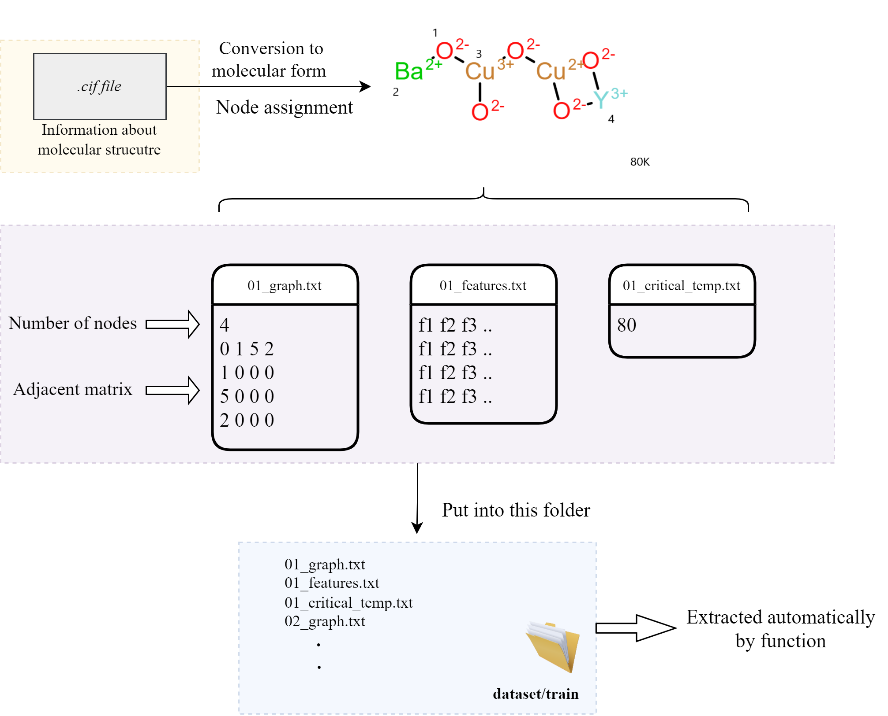

# Graph Neural Network for prediction of critical temperature of superconductor

Despite of good performance of compositional model, one of the major limitations is lacked to conserving structural features. Since structure of crystal has significant impact on superconductivity, approach should be to consider structural features into account. Structure of a molecules naturally can be represented as a graph with elements being node and bonds between elements being edge or arc. In machine learning, mostly structural data are dominant where we have fixed input length. But in real life we might not have always structured data such as in case of superconductor. Although there are ways to convert unstructured data to structured data, a lot of information is lost, which might be crucial and have great impact on model. One of the promising approaches of training model along with structural feature is Graph neural networks.



## Classes and Functions
### GraphNeuralSuperconductor
GraphNeuralSuperconductor is the main class that contains computation and weight initialization. This can be initialized by following command and requires number of features of nodes as input

```bash

        adj, number_of_nodes, critical_temperature_,features = trainset.nextbatch(batchsize)
        s,_ = net.forward_propagation(number_of_nodes,adj,features)  
        loss = net.loss(s,critical_temperature_)
        net.backward_propagation(loss,critical_temperature_,upsilon)
```
### Preprocess data
Since we have dataset in the text format in specific format. To make it available for computation, a class has been built which requires path of dataset as input and output train and test dataset, that can further be used.
```bash
  from utils import preprocessdata
  path="datasets/train"
  trainset,testset = preprocessdata.Preprocess(path).get_data()
```

### Extraction of adjacent matrix, critical temperature, features and number of nodes
Following method of class can be used to extract data information such as adjacent matrix, critical temperature, features and number of nodes
```bash

   adjacent_matrix, number_of_nodes, critical_temperature_,features = trainset.next_dataset(batchsize)
        
```

### Forward propagation
Following method can be used for forward propagation. There will be two output from this method: output after activation function and output from predictor function. Input paramter are following
- **number_of_nodes:** total number of nodes in the graph
- **adjacent_matrix:** Adjacency matrix from graph that shows connection of nodes
- **features:** Feature vector of all nodes of graph
```bash

   temp,output_temp = model.forward_propagation(number_of_nodes,adjacent_matrix,features)  
        
```
### Loss method
Loss function can be calculated using method 'loss' of Class GraphNeuralSuperconductor. It reuires intermediate result from forward method.

```bash

   loss = net.loss(temp,critical_temperature_)
        
```
      
## To train model
All the classes have been initialized in train.py. Input parameters can be given as argument using command line. Following arument needs to be passed and these arguments can be put inside train.py as default

```bash

   python train.py
    --N number of features
    --op optimizer(default SGD)
    --lr learningrate
    --iter number of iteration
    --batchsize size
    --ep epoch
    --datadir directory of training dataset
```


